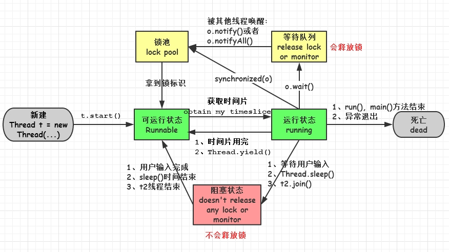
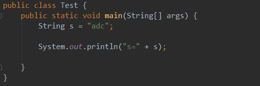

#### 1.Java 和 C++ 的区别

- 都是面向对象的语言，都支持封装、继承和多态

- Java 不提供指针来直接访问内存，程序内存更加安全
- Java 的类是单继承的，C++ 支持多重继承；虽然 Java 的类不可以多继承，但是接口可以多继承
- Java 有自动内存管理机制，不需要程序员手动释放无用内存

#### 2.字符型常量和字符串常量的区别

① 形式上: 字符常量是单引号引起的一个字符，字符串常量是双引号引起的若干个字符

② 含义上: 字符常量相当于一个整形值（ASCII 值），可以参加表达式运算，字符串常量代表一个地址值（该字符串在内存中存放位置）

③ 占内存大小：字符常量只占 2 个字节，字符串常量占若干个字节（至少一个字符结束标志)）

#### 3.重载和重写的区别

​	**重载：**发生在同一个类中，方法名必须相同，参数类型不同、个数不同、顺序不同，与返回值和访问修饰符无关。但方法返回值和访问修饰符可以不同，发生在编译时

​	**重写：**发生在父子类中，方法名、参数列表必须相同，返回值范围小于等于父类（如果返回值类型是 void 和基本数据类型，那么必须一致，如果是引用数据类型，重写方法的返回值类型可以和被重写方法的返回值类型一样或是它的子类），抛出的异常范围小于等于父类，访问修饰符范围大于等于父类；如果父类方法访问修饰符为 private 则子类就不能重写该方法

#### 4.Java 面向对象的三大特性

​	**封装：**封装把一个对象的属性私有化，同时提供一些可以被外界访问的属性的方法，如果属性不想被外界访问，我们大可不必提供方法给外界访问

​	**继承：**继承是使用已存在的类的定义作为基础建立新类的技术，新类的定义可以增加新的数据或新的功能，也可以用父类的功能，但不能选择性地继承父类。通过使用继承能够非常方便地复用以前的代码。其中父类 private 修饰的属性的方法，子类也继承了，只是无法访问。

​	**多态：**所谓多态就是指程序中定义的引用变量所指向的具体类型和通过该引用变量发出的方法调用在编程时并不确定，而是在程序运行期间才确定，即一个引用变量倒底会指向哪个类的实例对象，该引用变量发出的方法调用到底是哪个类中实现的方法，必须在由程序运行期间才能决定。在 Java 中有两种形式可以实现多态：*继承*（多个子类对同一方法的重写）和*接口*（实现接口并覆盖接口中同一方法）

#### 5.String 和 StringBuffer、StringBuilder 的区别是什么，String 为什么是不可变的

​	**可变性：**String 类中使用 final 关键字字符数组保存字符串，`private　final　char　value[]`，所以 String 对象是不可变的。而 StringBuilder 与 StringBuffer 都继承自 AbstractStringBuilder 类，在 AbstractStringBuilder 中也是使用字符数组保存字符串 `char[]value`，但是没有用 final 关键字修饰，所以这两种对象都是可变的

​	**线程安全性：**String 中的对象是不可变的，也可以理解为常量，线程安全；StringBuffer 对方法加了同步锁，所以是线程安全的；StringBuilder 并没有对方法进行加同步锁，所以是非线程安全的

​	**性能：**使用 “+” 拼接字符串的时候，实际上是创建了一个 StringBuilder 对象，并使用该对象的 append 方法进行字符串拼接，然后将得到的字符串通过 toString 方法返回给字符串对象（此时字符串对象已经改变，不再是原来的对象）；StringBuffer 每次都会对 StringBuffer 对象本身进行操作，而不是生成新的对象并改变对象引用

#### 6.接口和抽象类的区别

① 接口的方法默认是 public，所有方法在接口中不能有实现（Java 8 接口新增了 `默认方法` 和 `静态方法` ：静态方法可以直接调用，不能被重写；默认方法需要通过实现类实例化后调用），抽象类可以有非抽象的方法

② 接口中的实例变量默认是 final 类型的，而抽象类中则不一定 

③ 一个类可以实现多个接口，但最多只能实现一个抽象类 

④ 一个类实现接口的话要实现接口的所有方法，而抽象类不一定 

⑤ 接口不能用 new 实例化，但可以声明，但是必须引用一个实现该接口的对象

⑥ 从设计层面来说，抽象是对类的抽象，是一种模板设计，接口是行为的抽象，是一种行为的规范

#### 7.成员变量与局部变量的区别

1. 从语法形式上，成员变量是属于类的，而局部变量是在方法中定义的变量或是方法的参数；成员变量可以被 public,private,static 等修饰符所修饰，而局部变量不能被访问控制修饰符及 static 所修饰；但是，成员变量和局部变量都能被 final 所修饰
2. 从变量在内存中的存储方式来看，成员变量是对象的一部分，而对象存在于堆内存，局部变量存在于栈内存
3. 从变量在内存中的生存时间上看，成员变量是对象的一部分，它随着对象的创建而存在，而局部变量随着方法的调用而自动消失
4. 成员变量如果没有被赋初值，则会自动以类型的默认值而赋值（一种情况例外，被 final 修饰的成员变量必须显示赋值）；而局部变量则不会自动赋值

#### 8.为什么重写 equals 时必须重写 hashCode 方法

> hashCode() 的作用是获取哈希码，也称为散列码
>
> hashCode() 定义在 Object 类中，这意味着 Java 中的任何类都包含有 hashCode() 方法

1. 如果两个对象相等，则 hashcode 一定也是相同的
2. 两个对象相等，对两个对象分别调用 equals 方法都返回 true
3. 两个对象有相同的 hashcode 值，它们也不一定是相等的
4. 因此，equals 方法被覆盖过，则 hashCode 方法也必须被覆盖
5. hashCode() 的默认行为是对堆上的对象产生独特值。如果没有重写 hashCode()，则该 class 的两个对象无论如何都不会相等（即使这两个对象指向相同的数据）

#### 9.简述线程，程序、进程的基本概念，以及他们之间关系是什么

​	**程序：**是含有指令和数据的文件，被存储在磁盘或其他的数据存储设备中，也就是说程序是静态的代码

​	**进程：**是程序的一次执行过程，是系统运行程序的基本单位，因此进程是动态的。系统运行一个程序即是一个进程从创建，运行到消亡的过程。简单来说，一个进程就是一个执行中的程序，它在计算机中一个指令接着一个指令地执行着，同时，每个进程还占有某些系统资源，如CPU、内存空间、文件、文件、输入输出设备的使用权等。换句话说，当程序在执行时，将会被操作系统载入内存中

​	**线程：**与进程相似，但线程是一个比进程更小的执行单位。一个进程在其执行的过程中可以产生多个线程。与进程不同的是同类的多个线程共享同一块内存空间和一组系统资源，所以系统在产生一个线程，或是在各个线程之间作切换工作时，负担要比进程小得多，也正因为如此，线程也被称为轻量级进程

#### 10.线程有哪些基本状态

1. **新建(new)**：新创建了一个线程对象
2. **可运行(runnable)**：线程对象创建后，其他线程（比如main线程）调用了该对象的 start() 方法。该状态的线程位于可运行线程池中，等待被线程调度选中，获取 cpu 的使用权
3. **运行(running)**：可运行状态（runnable）的线程获得了 cpu 时间片（timeslice），执行程序代码
4. **阻塞(block)**：阻塞状态是指线程因为某种原因放弃了 cpu 使用权，即让出了 cpu timeslice，暂时停止运行。直到线程进入可运行（runnable）状态，才有机会再次获得 cpu timeslice 转到运行（running）状态。阻塞的情况分三种：
    ① 等待阻塞：运行（running）的线程执行 wait() 方法，JVM 会把该线程放入等待队列（waitting queue）中
    ② 同步阻塞：运行（running）的线程在获取对象的同步锁时，若该同步锁被别的线程占用，则 JVM 会把该线程放入锁池（lock pool）中
    ③ 其他阻塞：运行（running）的线程执行 Thread.sleep(long ms) 或 t.join() 方法，或者发出了 I/O 请求时，JVM 会把该线程置为阻塞状态。当 `sleep() 状态超时`或 `join() 等待线程终止或者超时`或 `I/O处理完毕`时，线程重新转入可运行（runnable）状态
5. **死亡(dead)**：线程run()、main()方法执行结束，或者因异常退出了run()方法，则该线程结束生命周期。死亡的线程不可再次复生

#### 11.final 关键字

final 关键字主要用在三个地方：变量、方法、类

1. 对于一个 final 变量，如果是基本数据类型的变量，则其数值一旦在初始化之后便不能更改；如果是引用类型的变量，则在对其初始化之后便不能再让其指向另一个对象
2. 当用 final 修饰一个类时，表明这个类不能被继承。final 类中的所有成员方法都会被隐式地指定为 final 方法
3. 使用 final 方法的原因有两个，第一个原因是把方法锁定，以防任何继承类修改它的含义；第二个原因是效率。在早期的Java实现版本中，会将final方法转为内嵌调用。但是如果方法过于庞大，可能看不到内嵌调用带来的任何性能提升，现在的 Java 版本已经不需要使用 final 方法进行这些优化了（《Java编程思想》第四版第 143 页）。类中所有的 private 方法都隐式地指定为 final

#### 12.字面量和符号引用

**字面量**是指由字母、数字等构成的字符串或数值，它只能作为右值出现，如：int a = 123。八大基本数据类型和 String 的赋值、null 值都是字面量。

**符号引用**以一组符号来描述所引用的目标，符号可以是任何形式的字面量，只要使用时能够无歧义的定位到目标即可。在编译时，java 类并不知道所引用的类的实际地址，因此只能使用符号引用来代替。

使用 javap -verbose 后

#### 13.ConcurrentHashMap 和 Hashtable 的区别

ConcurrentHashMap 和 Hashtable 的区别主要体现在实现线程安全的方式上不同。

- **底层数据结构：** JDK1.7的 ConcurrentHashMap 底层采用 **分段的数组+链表** 实现，JDK1.8 采用的数据结构跟 HashMap1.8 的结构一样，数组+链表/红黑二叉树。Hashtable 和 JDK1.8 之前的 HashMap 的底层数据结构类似都是采用 **数组+链表** 的形式，数组是 HashMap 的主体，链表则是主要为了解决哈希冲突而存在的；
- **实现线程安全的方式（重要）：** ① **在 JDK1.7 的时候，ConcurrentHashMap（分段锁）** 对整个桶数组进行了分割分段（Segment），每一把锁只锁容器其中一部分数据，多线程访问容器里不同数据段的数据，就不会存在锁竞争，提高并发访问率。 **到了 JDK1.8 的时候已经摒弃了 Segment 的概念，而是直接用 Node 数组+链表+红黑树的数据结构来实现，并发控制使用 synchronized 和 CAS 来操作。（JDK1.6以后对  synchronized 锁做了很多优化）**  整个看起来就像是优化过且线程安全的 HashMap，虽然在 JDK1.8 中还能看到 Segment 的数据结构，但是已经简化了属性，只是为了兼容旧版本；② **Hashtable(同一把锁)** ：使用 synchronized 来保证线程安全，效率非常低下。当一个线程访问同步方法时，其他线程也访问同步方法，可能会进入阻塞或轮询状态，如使用 put 添加元素，另一个线程不能使用 put 添加元素，也不能使用 get，竞争会越来越激烈效率越低。

